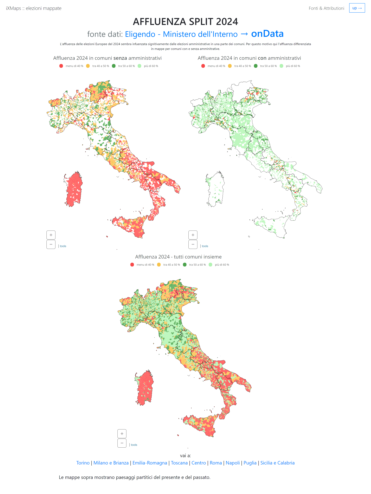

# elezioni Europee 2024 - scrutini

affluenza

<a href='./index_top_3_affluenza_split.html'>
</img>
</a>

Affluenza diviso per comuni con elezioni amministrative congiunte e comuni con solo elezioni europee.

